# Fitness Center Crowdedness Prediction

Bu proje, bir spor salonundaki kişi sayısını tarih, saat, sıcaklık, hafta sonu/tatil durumu ve akademik takvim gibi değişkenlerden yararlanarak tahmin etmeyi amaçlayan bir makine öğrenmesi çalışmasıdır.

Çalışma; veri keşfi, görselleştirme, veri ön işleme, farklı regresyon modellerinin eğitilmesi, performans karşılaştırması ve en başarılı modelin hiperparametre optimizasyonu adımlarını içerir.

> **En iyi sonuç:** RandomizedSearchCV ile optimize edilen **Random Forest Regressor**  
> **R²:** `0.9212` — **RMSE:** `6.4055` — **MSE:** `41.0298`

---

## İçindekiler

- [Projenin Amacı](#projenin-amacı)
- [Veri Seti](#veri-seti)
- [Proje Akışı](#proje-akışı)
- [Keşifsel Veri Analizi](#keşifsel-veri-analizi)
- [Veri Ön İşleme](#veri-ön-işleme)
- [Kullanılan Modeller](#kullanılan-modeller)
- [Model Sonuçları ve Karşılaştırma](#model-sonuçları-ve-karşılaştırma)
- [En İyi Model](#en-iyi-model)
- [Kurulum](#kurulum)
- [Çalıştırma](#çalıştırma)
- [Proje Yapısı](#proje-yapısı)
- [Önemli Teknik Notlar](#önemli-teknik-notlar)
- [Geliştirme Önerileri](#geliştirme-önerileri)

---

## Projenin Amacı

Spor salonlarının yoğunluk seviyesini önceden tahmin edebilmesi aşağıdaki alanlarda fayda sağlayabilir:

- Personel ve vardiya planlaması
- Temizlik ve bakım zamanlarının belirlenmesi
- Üyelere daha sakin saatlerin önerilmesi
- Ekipman ve alan kullanımının iyileştirilmesi
- Yoğun saatlerde kapasite yönetimi
- Enerji tüketiminin optimize edilmesi

Notebook’un hedef değişkeni `number_people` sütunudur. Problem bir **regresyon problemidir**, çünkü tahmin edilmek istenen değer sürekli/nümerik bir kişi sayısıdır.

---

## Veri Seti

Notebook içerisinde veri aşağıdaki dosyadan okunmaktadır:

```python
df = pd.read_csv("/content/15-gym_crowdedness.csv")
```

Bu yol Google Colab ortamına özeldir. Notebook farklı bir ortamda çalıştırılacaksa CSV dosyasının yolu güncellenmelidir.

### Veri setinin genel özellikleri

| Özellik | Değer |
|---|---:|
| Gözlem sayısı | 62.184 |
| Başlangıçtaki sütun sayısı | 11 |
| Eksik değer | Yok |
| Hedef değişken | `number_people` |
| Ortalama kişi sayısı | 29,07 |
| Medyan kişi sayısı | 28 |
| Standart sapma | 22,69 |
| Minimum kişi sayısı | 0 |
| Maksimum kişi sayısı | 145 |

### Sütun açıklamaları

| Sütun | Açıklama |
|---|---|
| `number_people` | Spor salonunda bulunan kişi sayısı; hedef değişken |
| `date` | Gözlemin tarih ve saat bilgisi |
| `timestamp` | Gün içerisindeki zamanı saniye cinsinden temsil eden zaman bilgisi |
| `day_of_week` | Haftanın günü; notebook’ta `0-6` aralığında kullanılır |
| `is_weekend` | Gözlemin hafta sonuna ait olup olmadığını belirten ikili değişken |
| `is_holiday` | Günün tatil olup olmadığını belirten ikili değişken |
| `temperature` | Gözlem anındaki sıcaklık değeri |
| `is_start_of_semester` | Akademik dönemin başlangıç zamanı olup olmadığını gösterir |
| `is_during_semester` | Gözlemin akademik dönem içinde olup olmadığını gösterir |
| `month` | Ay bilgisi; `1-12` aralığında |
| `hour` | Saat bilgisi; `0-23` aralığında |

> Sıcaklık birimi notebook içerisinde açıkça belirtilmemiştir. Veri kaynağındaki birim doğrulanmadan doğrudan °C veya °F olarak yorumlanmamalıdır.

---

## Proje Akışı

```mermaid
flowchart LR
    A[CSV Verisinin Okunması] --> B[Veri Kontrolü]
    B --> C[Keşifsel Veri Analizi]
    C --> D[Tarih Dönüşümü ve Özellik Üretimi]
    D --> E[Train-Test Ayrımı]
    E --> F[Standardizasyon]
    F --> G[Regresyon Modellerinin Eğitimi]
    G --> H[Performans Karşılaştırması]
    H --> I[Random Forest Optimizasyonu]
    I --> J[En İyi Modelin Seçilmesi]
```



Çalışmanın temel adımları:

1. Kütüphanelerin içe aktarılması
2. CSV verisinin pandas ile okunması
3. Veri tipi, boyut, eksik değer ve istatistik kontrolleri
4. Dağılım ve ilişkilerin grafiklerle incelenmesi
5. Tarih bilgisinden `year` özelliğinin üretilmesi
6. `date` ve `timestamp` sütunlarının model girdilerinden çıkarılması
7. Verinin eğitim ve test kümelerine ayrılması
8. Özelliklerin `StandardScaler` ile ölçeklendirilmesi
9. Altı temel regresyon yaklaşımının karşılaştırılması
10. Random Forest modelinin `RandomizedSearchCV` ile optimize edilmesi

---

## Keşifsel Veri Analizi

Notebook’ta aşağıdaki analizler ve görselleştirmeler bulunmaktadır.

### 1. Hedef değişkenin dağılımı

`number_people` değişkeni histogram ve KDE eğrisi ile incelenmiştir. Ayrıca boxplot kullanılarak olası aykırı değerler görselleştirilmiştir.

```python
sns.histplot(data=df, x="number_people", bins=30, kde=True)
sns.boxplot(data=df, x="number_people")
```

Bu inceleme, hedef değişkenin dağılım şeklini ve yüksek yoğunluk gözlemlerini anlamaya yardımcı olur.

### 2. Saatlik yoğunluk

Kişi sayısının saatlere göre ortalaması hesaplanmış ve çizgi grafik ile gösterilmiştir.

```python
df.groupby("hour")["number_people"].mean()
```

Bu analiz spor salonunun gün içerisindeki yoğunluk profilini ortaya çıkarmak için kullanılır.

### 3. Haftanın günlerine göre yoğunluk

Haftanın her günü için ortalama kişi sayısı hesaplanmıştır. Günler Türkçe etiketlerle gösterilmiştir:

- Pazartesi
- Salı
- Çarşamba
- Perşembe
- Cuma
- Cumartesi
- Pazar

### 4. Gün-saat ısı haritası

`day_of_week` ve `hour` değişkenleri birlikte değerlendirilerek bir pivot tablo oluşturulmuş, ardından ısı haritası çizilmiştir.

Bu grafik, yalnızca “hangi gün daha yoğun?” sorusunu değil, “hangi günün hangi saatinde daha yoğun?” sorusunu da yanıtlamaya yardımcı olur.

### 5. Hafta içi ve hafta sonu karşılaştırması

`is_weekend` değişkenine göre kişi sayıları boxplot ile karşılaştırılmıştır. Saatlik yoğunluk eğrileri de hafta içi ve hafta sonu için ayrı ayrı gösterilmiştir.

### 6. Tatil etkisi

Tatil günleri ile normal günlerdeki kişi sayısı dağılımları karşılaştırılmıştır.

### 7. Sıcaklık ilişkisi

Sıcaklık ile kişi sayısı arasındaki ilişki scatter plot ve doğrusal regresyon eğrisi ile incelenmiştir.

### 8. Aylık değişim

Aylara göre ortalama kişi sayısı hesaplanarak mevsimsel değişimler görselleştirilmiştir.

### 9. Akademik takvim etkisi

Aşağıdaki iki değişkenin kişi sayısı üzerindeki etkisi ayrı boxplot’larla incelenmiştir:

- `is_during_semester`
- `is_start_of_semester`

### 10. Zaman serisi görünümü

Günlük ortalama kişi sayısı ve 7 günlük hareketli ortalama hesaplanmıştır.

```python
gunluk_ortalama["hareketli_ortalama"] = (
    gunluk_ortalama["number_people"]
    .rolling(window=7, min_periods=1)
    .mean()
)
```

Hareketli ortalama, günlük dalgalanmaları yumuşatarak genel eğilimin daha rahat görülmesini sağlar.

### 11. Korelasyon analizi

Sayısal değişkenler arasındaki Pearson korelasyonları bir ısı haritası ile gösterilmiştir.

Korelasyon analizi doğrusal ilişkileri gösterir; düşük korelasyon, değişkenin doğrusal olmayan modeller için değersiz olduğu anlamına gelmez. Random Forest ve Decision Tree gibi modeller doğrusal olmayan ilişkileri de öğrenebilir.

---

## Veri Ön İşleme

### Tarih dönüşümü

Tarih sütunu önce datetime formatına, daha sonra UTC bilgisiyle birlikte tekrar datetime formatına dönüştürülmüştür:

```python
df["date"] = pd.to_datetime(df["date"], utc=True)
```

`utc=True` kullanılması, karışık saat dilimi ofsetlerinden kaynaklanabilecek pandas uyarılarını ve gelecekteki uyumluluk sorunlarını azaltır.

### Yıl özelliğinin oluşturulması

```python
df["year"] = df["date"].dt.year
```

Tarih sütunundan yıl bilgisi çıkarılarak modele yeni bir özellik eklenmiştir.

### Kullanılmayan sütunların çıkarılması

```python
df.drop("date", axis=1, inplace=True)
df.drop("timestamp", axis=1, inplace=True)
```

Model eğitiminde ham tarih ve saniye tabanlı timestamp kullanılmamıştır.

### Girdi ve hedef ayrımı

```python
X = df.drop("number_people", axis=1)
y = df["number_people"]
```

Modelin kullandığı özellikler:

- `day_of_week`
- `is_weekend`
- `is_holiday`
- `temperature`
- `is_start_of_semester`
- `is_during_semester`
- `month`
- `hour`
- `year`

### Eğitim-test ayrımı

```python
X_train, X_test, y_train, y_test = train_test_split(
    X,
    y,
    test_size=0.25,
    random_state=15
)
```

| Küme | Yaklaşık gözlem sayısı | Oran |
|---|---:|---:|
| Eğitim | 46.638 | %75 |
| Test | 15.546 | %25 |

`random_state=15`, veri ayrımının tekrar üretilebilir olmasını sağlar.

### Standardizasyon

```python
sc = StandardScaler()
X_train = sc.fit_transform(X_train)
X_test = sc.transform(X_test)
```

Standardizasyon özellikle Lasso, Ridge ve KNN gibi ölçeğe duyarlı modeller için önemlidir. Decision Tree ve Random Forest modelleri için zorunlu değildir; ağaç tabanlı modeller değişkenlerin sıralamasına göre bölünme yaptığı için ölçekten büyük ölçüde bağımsızdır.

Scaler yalnızca eğitim verisine `fit` edilip test verisine `transform` uygulandığı için bu aşamada doğrudan test verisi sızıntısı yapılmamıştır.

---

## Kullanılan Modeller

### 1. Linear Regression

Doğrusal Regresyon, hedef değişken ile özellikler arasında doğrusal bir ilişki kurar.

**Avantajları**

- Basit ve hızlıdır.
- Sonuçları yorumlamak kolaydır.
- Güçlü bir başlangıç/baseline modelidir.

**Dezavantajları**

- Karmaşık ve doğrusal olmayan ilişkileri yakalayamaz.
- Saat, gün ve dönem etkileşimlerini tek başına yeterince modelleyemeyebilir.

### 2. Lasso Regression

Lasso, doğrusal regresyona L1 düzenlileştirmesi ekler. Bazı katsayıları sıfıra kadar düşürebildiği için özellik seçimi etkisi oluşturabilir.

**Avantajları**

- Gereksiz özelliklerin etkisini azaltabilir.
- Daha sade modeller oluşturabilir.

**Dezavantajları**

- Düzenlileştirme şiddeti optimize edilmediğinde performans düşebilir.
- Bu notebook’ta varsayılan `alpha=1.0` kullanılmıştır.

### 3. Ridge Regression

Ridge, doğrusal regresyona L2 düzenlileştirmesi ekler. Katsayıları küçültür ancak genellikle sıfıra indirmez.

**Avantajları**

- Birbiriyle ilişkili özelliklerde daha kararlı olabilir.
- Aşırı büyük katsayıları sınırlar.

**Dezavantajları**

- Doğrusal olmayan ilişkileri yakalayamaz.
- Bu notebook’ta `alpha` değeri optimize edilmemiştir.

### 4. Decision Tree Regressor

Karar Ağacı, özellik uzayını bölgelere ayırarak doğrusal olmayan örüntüleri öğrenir.

**Avantajları**

- Doğrusal olmayan ilişkileri öğrenebilir.
- Özellikler arası etkileşimleri otomatik yakalar.
- Ölçeklendirme gerektirmez.

**Dezavantajları**

- Kontrolsüz büyüdüğünde overfitting yapabilir.
- Veri değişikliklerine karşı kararsız olabilir.
- Notebook’ta `random_state` ve düzenlileştirici ağaç parametreleri belirtilmemiştir.

### 5. Random Forest Regressor

Random Forest, çok sayıda karar ağacının tahminlerini birleştirir.

**Avantajları**

- Tek karar ağacına göre daha kararlı ve genellikle daha genellenebilir sonuç verir.
- Doğrusal olmayan ilişkileri ve karmaşık etkileşimleri yakalayabilir.
- Aykırı değerlere ve gürültüye karşı tek ağaca göre daha dayanıklıdır.

**Dezavantajları**

- Doğrusal modellere göre daha fazla işlem gücü ve bellek kullanır.
- Modelin yorumlanması daha zordur.
- Tahmin süresi tek karar ağacından daha uzundur.

### 6. K-Nearest Neighbors Regressor

KNN, yeni bir gözlemin hedef değerini özellik uzayındaki en yakın komşularına göre tahmin eder.

**Avantajları**

- Doğrusal olmayan ilişkileri yakalayabilir.
- Varsayımları az olan basit bir yöntemdir.

**Dezavantajları**

- Ölçeklendirmeye duyarlıdır.
- Veri büyüdükçe tahmin maliyeti artar.
- Yüksek boyutlarda mesafe ölçümleri anlamını kaybedebilir.

### 7. Optimize Edilmiş Random Forest

Varsayılan Random Forest modelinin performansını geliştirmek için `RandomizedSearchCV` kullanılmıştır.

```python
random_search = RandomizedSearchCV(
    estimator=RandomForestRegressor(),
    param_distributions=params,
    n_iter=20,
    cv=3,
    scoring="neg_root_mean_squared_error",
    random_state=42,
    n_jobs=-1,
    verbose=1
)
```

Arama sırasında 20 farklı parametre kombinasyonu, 3 katlı çapraz doğrulama ile değerlendirilmiştir. Toplamda 60 model eğitimi gerçekleştirilmiştir.

---

## Model Sonuçları ve Karşılaştırma

### Kullanılan metrikler

#### R² skoru

Modelin hedef değişkendeki varyansın ne kadarını açıklayabildiğini gösterir.

- `1.0`: Kusursuz tahmin
- `0.0`: Ortalama tahmini kadar performans
- Negatif değer: Ortalama tahmininden daha kötü performans

> R² bir “doğruluk yüzdesi” değildir. Örneğin `R²=0.9212`, modelin test verisindeki varyansın yaklaşık %92,12’sini açıkladığını ifade eder.

#### Mean Squared Error — MSE

Tahmin hatalarının karelerinin ortalamasıdır. Büyük hataları daha fazla cezalandırır. Düşük değer daha iyidir.

#### Root Mean Squared Error — RMSE

MSE’nin kareköküdür ve hedef değişkenle aynı birimdedir. Bu nedenle pratik yorumlaması daha kolaydır. Düşük değer daha iyidir.

### Test sonuçları

| Sıra | Model | R² | MSE | RMSE |
|---:|---|---:|---:|---:|
| 1 | **Optimize Random Forest** | **0.9212** | **41.0298** | **6.4055** |
| 2 | Random Forest | 0.9203 | 41.5206 | 6.4436 |
| 3 | Decision Tree | 0.9169 | 43.2709 | 6.5781 |
| 4 | KNN | 0.9016 | 51.2417 | 7.1583 |
| 5 | Linear Regression | 0.5989 | 208.8208 | 14.4506 |
| 6 | Ridge Regression | 0.5989 | 208.8208 | 14.4506 |
| 7 | Lasso Regression | 0.5848 | 216.1932 | 14.7035 |

### Sonuçların yorumu

- Ağaç tabanlı modeller doğrusal modellere göre açık biçimde daha iyi sonuç vermiştir.
- Bu fark, spor salonu yoğunluğu ile saat, gün, sıcaklık ve akademik dönem değişkenleri arasındaki ilişkinin yalnızca doğrusal olmadığını düşündürmektedir.
- Random Forest, tek Decision Tree modelinden daha başarılıdır. Birden fazla ağacın birleştirilmesi, varyansı azaltarak daha kararlı tahminler üretmiştir.
- KNN güçlü bir sonuç üretse de hem Random Forest hem de Decision Tree’nin gerisinde kalmıştır.
- Linear Regression ve Ridge neredeyse aynı performansı göstermiştir.
- Lasso, varsayılan düzenlileştirme değeriyle doğrusal modeller arasında en düşük sonucu vermiştir.

### En iyi modele göre hata azalması

Optimize Random Forest modelinin RMSE değeri:

- Linear Regression’dan yaklaşık **%55,67 daha düşük**
- Lasso’dan yaklaşık **%56,44 daha düşük**
- Ridge’den yaklaşık **%55,67 daha düşük**
- Decision Tree’den yaklaşık **%2,62 daha düşük**
- KNN’den yaklaşık **%10,52 daha düşük**
- Varsayılan Random Forest’tan yaklaşık **%0,59 daha düşük**

Varsayılan Random Forest ile optimize edilmiş sürüm arasındaki fark küçüktür. Bu durum, varsayılan parametrelerin veri setinde zaten güçlü çalıştığını; hiperparametre aramasının ise sınırlı ama ölçülebilir bir iyileşme sağladığını gösterir.

---

## En İyi Model

Notebook sonuçlarına göre en iyi model:

# Optimize Edilmiş Random Forest Regressor

### En iyi parametreler

```python
{
    "n_estimators": 150,
    "min_samples_split": 2,
    "min_samples_leaf": 1,
    "max_samples": 0.8,
    "max_features": 0.7,
    "max_depth": None,
    "bootstrap": True
}
```

### Performans

| Metrik | Sonuç |
|---|---:|
| R² | 0.9211958326 |
| MSE | 41.0298231130 |
| RMSE | 6.4054526080 |

### Neden en iyi model?

Optimize Random Forest:

1. En yüksek R² değerini üretmiştir.
2. En düşük MSE değerine sahiptir.
3. En düşük RMSE değerine sahiptir.
4. Doğrusal olmayan saat, gün, sıcaklık ve dönem etkileşimlerini öğrenebilir.
5. Tek karar ağacına göre daha kararlı bir tahmin yapısı sunar.
6. Çapraz doğrulama tabanlı hiperparametre aramasından geçirilmiştir.

RMSE değerinin yaklaşık `6.41` olması, test kümesinde tahminlerin gerçek kişi sayısından tipik olarak yaklaşık 6–7 kişi düzeyinde sapma gösterdiği şeklinde yorumlanabilir. Ancak RMSE büyük hataları daha fazla ağırlıklandırdığı için bu ifade kesin bir ortalama mutlak hata olarak değerlendirilmemelidir.

### Üretim ortamı için seçim

Yalnızca notebook’taki test sonuçları dikkate alındığında üretim için ilk aday optimize edilmiş Random Forest’tır.

Bununla birlikte gerçek bir üretim kararı verilmeden önce aşağıdakiler de ölçülmelidir:

- Zaman bazlı test performansı
- Mean Absolute Error
- Yoğun ve sakin saatlerde ayrı hata analizi
- Tahmin gecikmesi
- Model boyutu
- Veri değişimi ve model drift’i
- Farklı dönemlerde genelleme performansı

---

## Kurulum

### Gereksinimler

- Python 3.9 veya üzeri
- Jupyter Notebook veya Google Colab

### Kullanılan kütüphaneler

- NumPy
- pandas
- Matplotlib
- seaborn
- scikit-learn

### Paketlerin kurulması

```bash
pip install numpy pandas matplotlib seaborn scikit-learn jupyter
```

Bir sanal ortam kullanılması önerilir:

```bash
python -m venv .venv
```

Linux/macOS:

```bash
source .venv/bin/activate
```

Windows:

```bash
.venv\Scripts\activate
```

Ardından bağımlılıklar kurulabilir:

```bash
pip install numpy pandas matplotlib seaborn scikit-learn jupyter
```

---

## Çalıştırma

### Google Colab

1. `Fitness.ipynb` dosyasını Colab’da açın.
2. `15-gym_crowdedness.csv` dosyasını Colab oturumuna yükleyin.
3. Dosya yolunun aşağıdaki kodla uyumlu olduğunu kontrol edin:

```python
df = pd.read_csv("/content/15-gym_crowdedness.csv")
```

4. Hücreleri sırasıyla çalıştırın.

### Yerel Jupyter ortamı

CSV dosyası notebook ile aynı klasördeyse veri okuma satırını şu şekilde değiştirin:

```python
df = pd.read_csv("15-gym_crowdedness.csv")
```

Ardından:

```bash
jupyter notebook
```

komutunu çalıştırın ve `Fitness.ipynb` dosyasını açın.

### Baştan sona çalıştırma

Notebook hücrelerinin sırası veri dönüşümleri açısından önemlidir. Jupyter menüsünden:

```text
Kernel > Restart & Run All
```

veya Colab’da:

```text
Runtime > Run all
```

seçeneği kullanılmalıdır.

---

## Proje Yapısı

Önerilen klasör yapısı:

```text
fitness-crowdedness-prediction/
├── Fitness.ipynb
├── 15-gym_crowdedness.csv
├── README.md
├── requirements.txt
├── models/
│   └── random_forest.joblib
└── outputs/
    ├── figures/
    └── metrics/
```

Mevcut notebook modeli dosyaya kaydetmemektedir. Üretim kullanımı için eğitilen scaler ve model birlikte saklanmalıdır.

Örnek:

```python
import joblib

joblib.dump(sc, "models/scaler.joblib")
joblib.dump(random_search.best_estimator_, "models/random_forest.joblib")
```

Yükleme:

```python
scaler = joblib.load("models/scaler.joblib")
model = joblib.load("models/random_forest.joblib")
```

---

## Önemli Teknik Notlar

### 1. Rastgele ayrım zaman bağımlılığını dikkate almıyor

Notebook’ta `train_test_split` kullanılarak rastgele ayrım yapılmıştır. Veri zaman bilgisi içerdiği için bu yaklaşım gelecekteki gözlemlere genelleme performansını olduğundan daha iyi gösterebilir.

Daha gerçekçi bir değerlendirme için eski tarihler eğitim, daha yeni tarihler test verisi olarak kullanılmalıdır.

Örnek yaklaşım:

```python
df = df.sort_values("date")

split_index = int(len(df) * 0.75)
train_df = df.iloc[:split_index]
test_df = df.iloc[split_index:]
```

Alternatif olarak `TimeSeriesSplit` kullanılabilir.

### 2. Random Forest için `random_state` tanımlanmamış

Temel `DecisionTreeRegressor()` ve `RandomForestRegressor()` modellerinde `random_state` belirtilmemiştir. Bu nedenle notebook tekrar çalıştırıldığında sonuçlar küçük farklılıklar gösterebilir.

Öneri:

```python
DecisionTreeRegressor(random_state=42)
RandomForestRegressor(random_state=42, n_jobs=-1)
```

RandomizedSearchCV içindeki Random Forest estimator’ına da `random_state` verilmelidir:

```python
RandomForestRegressor(random_state=42)
```

### 3. MAE içe aktarılmış ancak raporlanmamış

Notebook’ta `mean_absolute_error` içe aktarılmış olmasına rağmen model sonuçlarında kullanılmamıştır.

```python
mae = mean_absolute_error(y_test, y_pred)
```

MAE, tahminlerin gerçek değerden ortalama kaç kişi saptığını daha doğrudan ifade eder ve RMSE ile birlikte raporlanması yararlı olur.

### 4. Baseline modeller için çapraz doğrulama yok

Temel modeller tek bir train-test ayrımı üzerinde değerlendirilmiştir. Sonuçların ayrım seçimine duyarlı olup olmadığını görmek için tüm modeller çapraz doğrulama ile karşılaştırılmalıdır.

### 5. Hiperparametre araması sınırlı

RandomizedSearchCV yalnızca 20 kombinasyon denemektedir. Daha geniş veya veri odaklı bir arama uzayı performansı geliştirebilir. Bununla birlikte arama uzayının gereksiz büyütülmesi işlem maliyetini artırır.

### 6. StandardScaler ağaç tabanlı modeller için gerekli değil

Tek bir ölçeklenmiş veri setiyle tüm modellerin çalıştırılması kodu sadeleştirir; ancak ağaç tabanlı modeller ölçeklendirme gerektirmez. Model bazlı `Pipeline` kullanılması daha temiz bir yaklaşım olur.

### 7. Kategorik zaman özellikleri döngüseldir

`hour=23` ile `hour=0`, sayısal olarak uzak görünse de gerçekte komşudur. Aynı durum aylar ve haftanın günleri için de geçerlidir.

Döngüsel dönüşüm uygulanabilir:

```python
df["hour_sin"] = np.sin(2 * np.pi * df["hour"] / 24)
df["hour_cos"] = np.cos(2 * np.pi * df["hour"] / 24)

df["day_sin"] = np.sin(2 * np.pi * df["day_of_week"] / 7)
df["day_cos"] = np.cos(2 * np.pi * df["day_of_week"] / 7)

df["month_sin"] = np.sin(2 * np.pi * (df["month"] - 1) / 12)
df["month_cos"] = np.cos(2 * np.pi * (df["month"] - 1) / 12)
```

### 8. Tahmin aralığı bulunmuyor

Model yalnızca nokta tahmini üretmektedir. Operasyonel kararlar için tahmin belirsizliğinin veya güven aralığının sunulması faydalı olabilir.

---

## Geliştirme Önerileri

### Modelleme

- Gradient Boosting Regressor denenebilir.
- HistGradientBoostingRegressor denenebilir.
- XGBoost, LightGBM veya CatBoost ile karşılaştırma yapılabilir.
- Lasso ve Ridge için `alpha` optimizasyonu yapılabilir.
- KNN için `n_neighbors`, `weights` ve mesafe metriği optimize edilebilir.
- Decision Tree için `max_depth`, `min_samples_leaf` ve pruning parametreleri ayarlanabilir.
- Stacking veya voting ensemble yaklaşımları denenebilir.

### Özellik mühendisliği

- Saat, gün ve ay için sinüs-kosinüs dönüşümleri eklenebilir.
- Gecikmeli kişi sayısı özellikleri oluşturulabilir.
- Önceki saat/gün ortalamaları kullanılabilir.
- Resmî tatil türleri ayrıştırılabilir.
- Hava durumu değişkenleri genişletilebilir.
- Saat ve hafta sonu etkileşimleri eklenebilir.
- Akademik dönem haftası veya sınav dönemi gibi değişkenler oluşturulabilir.

> Gecikmeli özellikler üretilirken yalnızca tahmin anından önce bilinen veriler kullanılmalıdır; aksi halde veri sızıntısı oluşur.

### Değerlendirme

- MAE, MedAE ve MAPE benzeri ek metrikler raporlanabilir.
- MAPE, gerçek kişi sayısının sıfır olduğu gözlemlerde uygun değildir; sıfır değerler için dikkatli kullanılmalıdır.
- Zaman bazlı validasyon uygulanabilir.
- Tahmin-gerçek grafiklerine yer verilebilir.
- Residual dağılımı incelenebilir.
- Saat ve yoğunluk seviyesine göre hata analizi yapılabilir.
- Güven aralıkları bootstrap veya quantile yöntemleriyle hesaplanabilir.

### Kod kalitesi

- Ön işleme ve model `Pipeline` içerisinde birleştirilebilir.
- Tekrarlanan değerlendirme kodu bir fonksiyona dönüştürülebilir.
- Sonuçlar DataFrame olarak saklanıp otomatik sıralanabilir.
- Sabitler ve dosya yolları merkezi bir konfigürasyonda tutulabilir.
- Kütüphane sürümleri `requirements.txt` ile sabitlenebilir.
- Model ve scaler `joblib` ile kaydedilebilir.

Örnek değerlendirme fonksiyonu:

```python
def evaluate_model(name, model, X_train, X_test, y_train, y_test):
    model.fit(X_train, y_train)
    predictions = model.predict(X_test)

    return {
        "Model": name,
        "R2": r2_score(y_test, predictions),
        "MAE": mean_absolute_error(y_test, predictions),
        "MSE": mean_squared_error(y_test, predictions),
        "RMSE": mean_squared_error(
            y_test,
            predictions,
            squared=False
        )
    }
```

---

## Genel Sonuç

Bu çalışma, spor salonu yoğunluğunu tahmin etmede doğrusal olmayan modellerin belirgin bir avantaja sahip olduğunu göstermektedir.

Test sonuçlarına göre:

- Doğrusal modeller yaklaşık `0.59` R² düzeyinde kalmıştır.
- KNN `0.90` üzeri R² elde etmiştir.
- Decision Tree ve Random Forest modelleri `0.91` üzeri R² üretmiştir.
- En yüksek performans, hiperparametre optimizasyonlu Random Forest ile elde edilmiştir.

**Nihai model sıralaması:**

```text
Optimize Random Forest
> Random Forest
> Decision Tree
> KNN
> Linear Regression
> Ridge Regression
> Lasso Regression
```

Notebook kapsamındaki metriklere göre önerilen model **Optimize Random Forest Regressor**’dır. Ancak modelin gerçek hayatta kullanılmasından önce zaman bazlı test, ek hata metrikleri, tekrarlanabilirlik ayarları ve model izleme süreçleri eklenmelidir.
